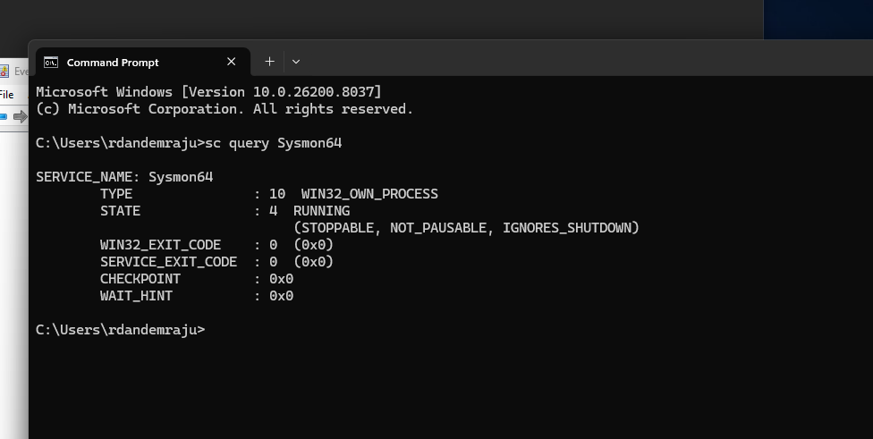
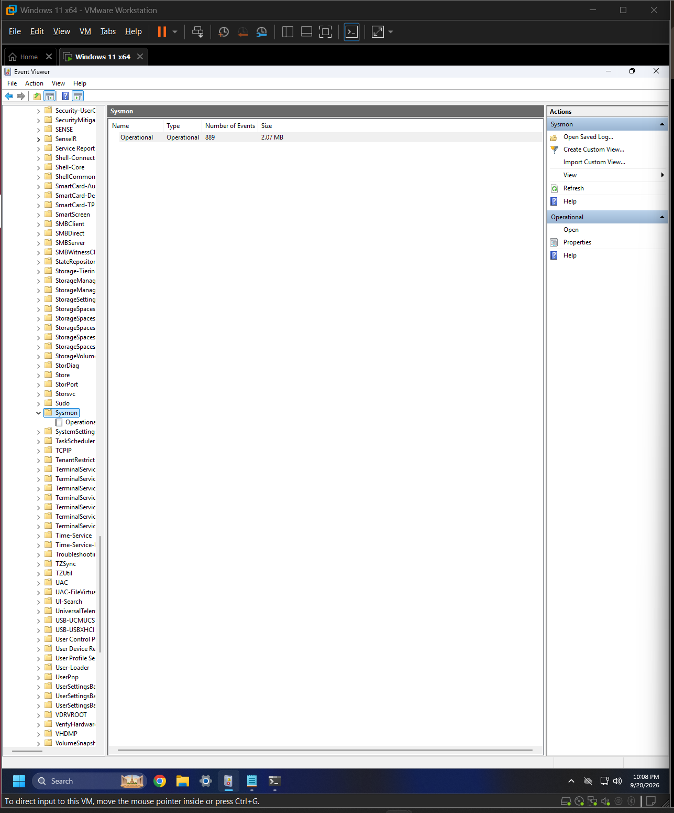
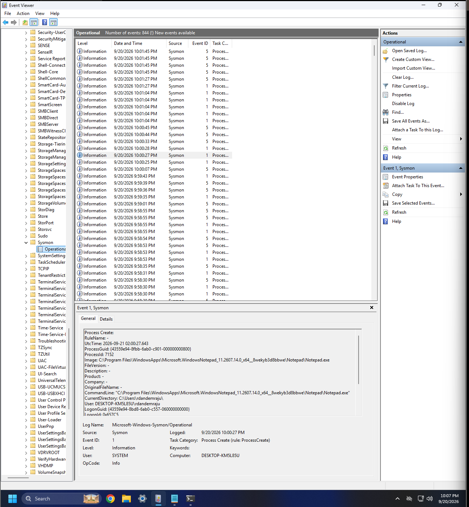
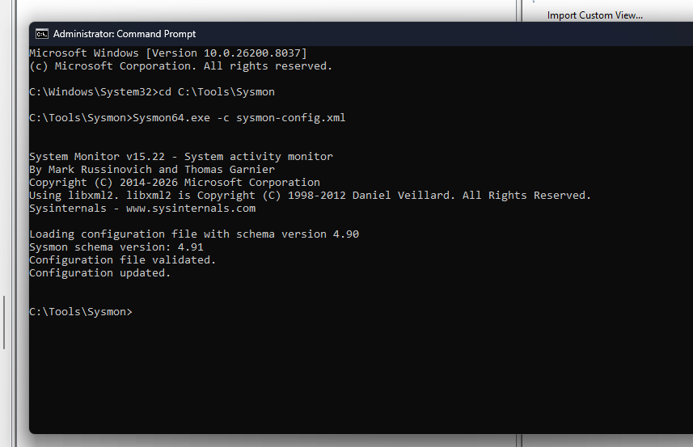
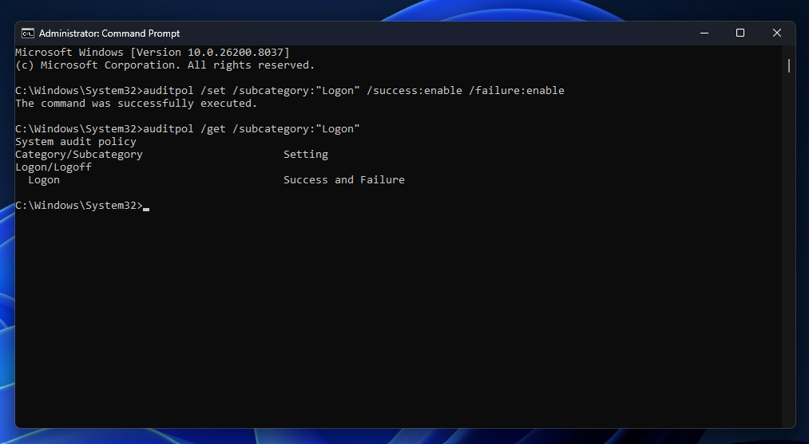
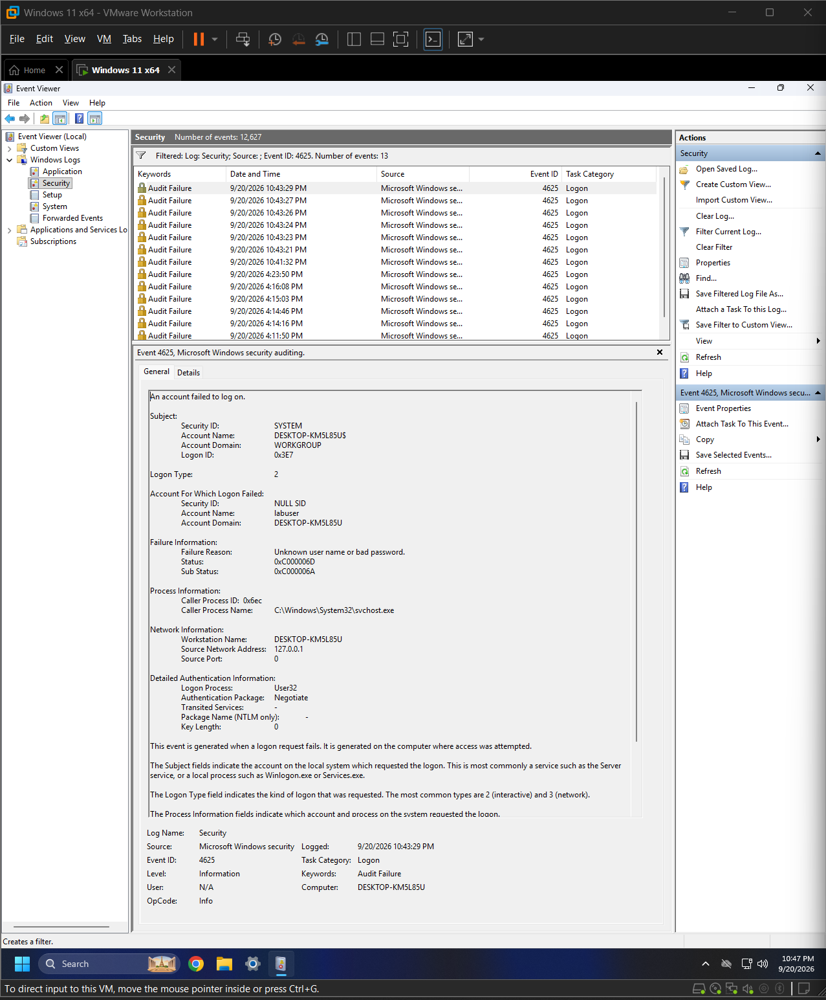

# Windows Security Monitoring & Detection Lab

## Overview

This project is an isolated Windows 11 Enterprise security lab built
using VMware Workstation Pro. The lab is designed to practice endpoint
monitoring, Windows event analysis, detection engineering, and incident
investigation.

## Lab Environment

- VMware Workstation Pro
- Windows 11 Enterprise
- Microsoft Sysmon
- Windows Event Viewer
- Windows Security Auditing

## Objectives

- Configure endpoint telemetry using Sysmon
- Analyze Windows and Sysmon event logs
- Generate controlled security events
- Investigate authentication and process activity
- Develop detection logic
- Document simulated security incidents

## Progress

### 1. Sysmon Installation

Installed Microsoft Sysmon as a Windows service and verified that the
service was actively running.

### 2. Sysmon Event Collection

Verified that Sysmon was generating telemetry in the Sysmon Operational
event log.

### 3. Process Creation Monitoring

Generated a controlled Notepad process and identified the corresponding
Sysmon Event ID 1 process creation event.

### 4. Custom Sysmon Configuration

Created and applied a custom Sysmon XML configuration for process creation,
network connections, file creation, and DNS queries.

### 5. Sysmon Telemetry Testing

Successfully generated and identified multiple Sysmon event types:

- Event ID 1 - Process Creation
- Event ID 3 - Network Connection
- Event ID 11 - File Creation
- Event ID 22 - DNS Query

### 6. Failed Authentication Monitoring

Enabled Windows auditing for successful and failed logon attempts.

Generated multiple controlled failed authentication attempts against a
lab account and identified Windows Security Event ID 4625.

## Current Findings

Windows Security Event ID 4625 captured repeated failed interactive
authentication attempts against the lab account. The event included the
account name, failure reason, logon type, source information, and process
information.

## Next Steps

- Document the failed-login investigation
- Detect local user creation
- Detect administrator group membership changes
- Monitor PowerShell activity
- Monitor Windows service activity
- Integrate Windows telemetry with a SIEM
