# Windows Security Monitoring & Detection Lab

## Overview

This project is an isolated Windows 11 Enterprise security lab built using VMware Workstation Pro. The lab is designed to practice endpoint monitoring, Windows event analysis, detection engineering, and incident investigation.

## Lab Environment

- VMware Workstation Pro
- Windows 11 Enterprise
- Microsoft Sysmon
- Windows Event Viewer
- Windows Security Auditing
- PowerShell Script Block Logging

## Objectives

- Configure endpoint telemetry using Sysmon
- Analyze Windows and Sysmon event logs
- Generate controlled security events
- Investigate authentication and process activity
- Monitor account and privilege changes
- Monitor PowerShell activity
- Detect service creation
- Correlate events from multiple Windows logging sources
- Document simulated security incidents

## Progress

### 1. Sysmon Installation

Installed Microsoft Sysmon as a Windows service and verified that the service was actively running.

### 2. Sysmon Event Collection

Verified that Sysmon was generating telemetry in the Sysmon Operational event log.

### 3. Process Creation Monitoring

Generated a controlled Notepad process and identified the corresponding Sysmon Event ID 1 process creation event.

### 4. Custom Sysmon Configuration

Created and applied a custom Sysmon XML configuration for process creation, network connections, file creation, and DNS queries.

### 5. Sysmon Telemetry Testing

Successfully generated and identified multiple Sysmon event types:

- Event ID 1 - Process Creation
- Event ID 3 - Network Connection
- Event ID 11 - File Creation
- Event ID 22 - DNS Query

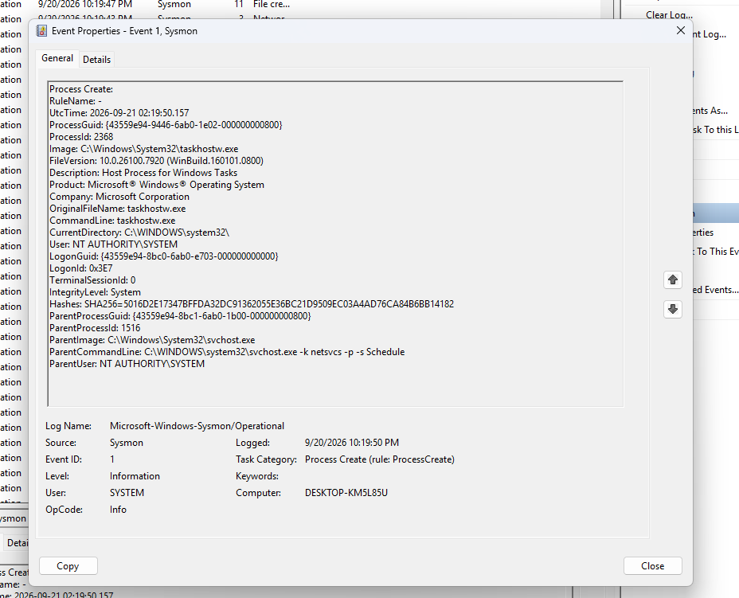

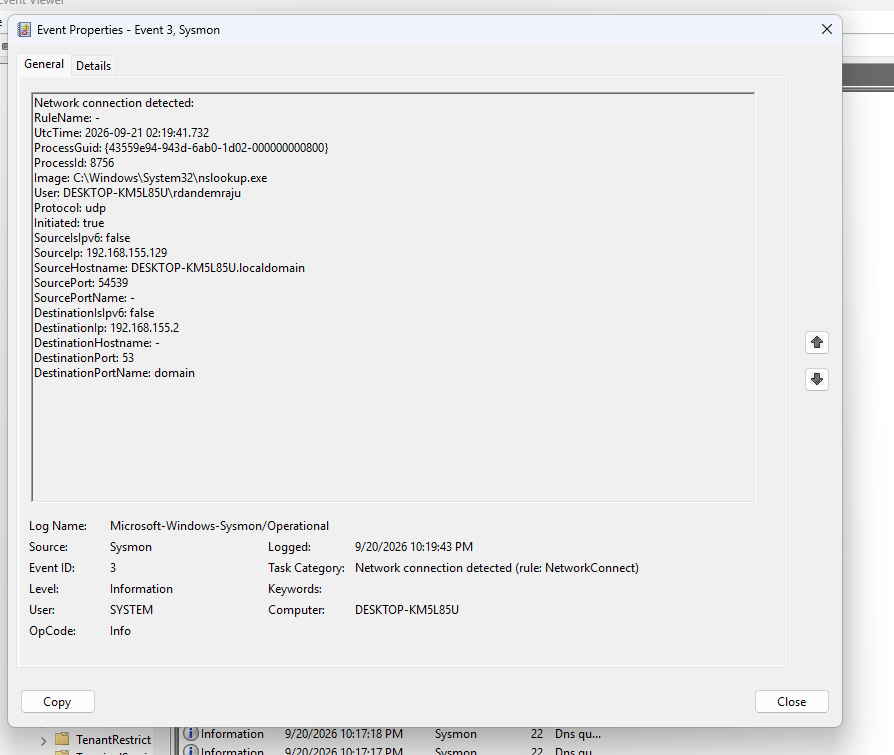

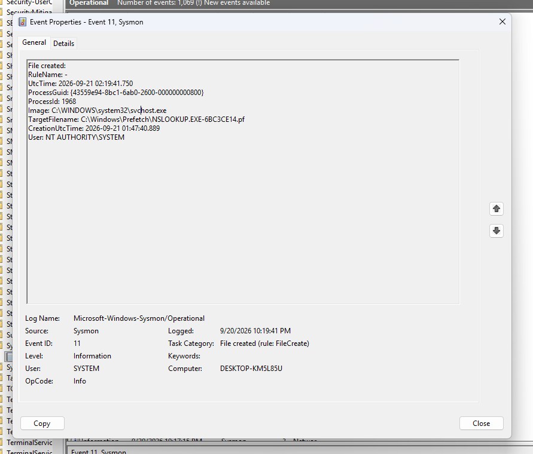

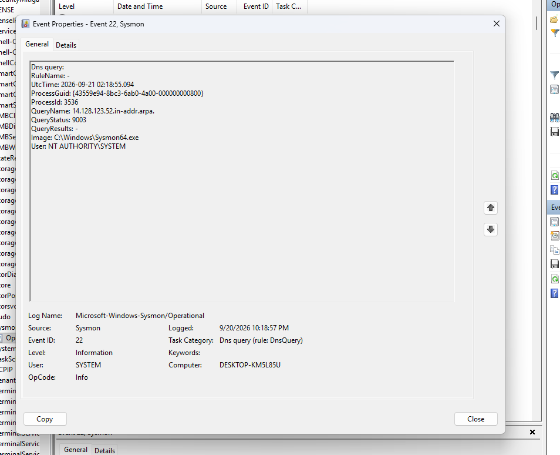

### 6. Failed Authentication Monitoring

Enabled Windows auditing for successful and failed logon attempts.

Generated multiple controlled failed authentication attempts against the `labuser` account and identified Windows Security Event ID 4625.

### 7. Local User Account Creation

Enabled User Account Management auditing and created a controlled local test account named `testuser`.

Windows Security Event ID 4720 recorded the creation of the account.

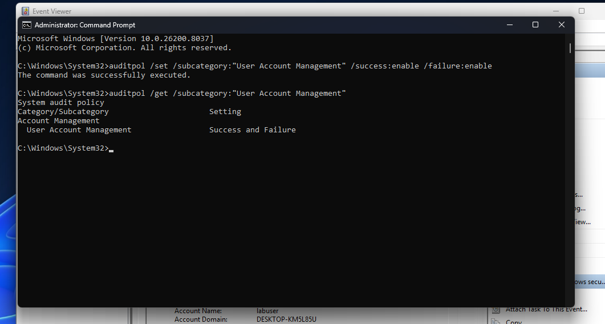

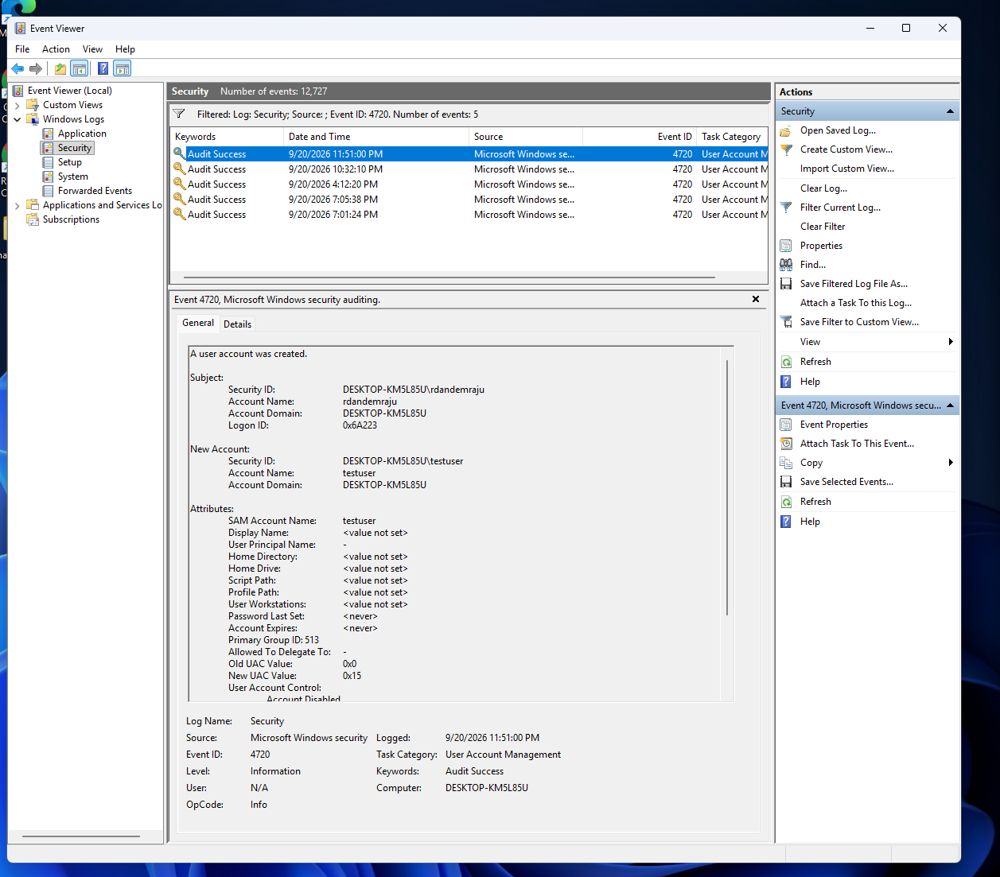

### 8. Administrator Group Membership Monitoring

Added the controlled `testuser` account to the local Administrators group.

Windows Security Event ID 4732 recorded the security group membership change.

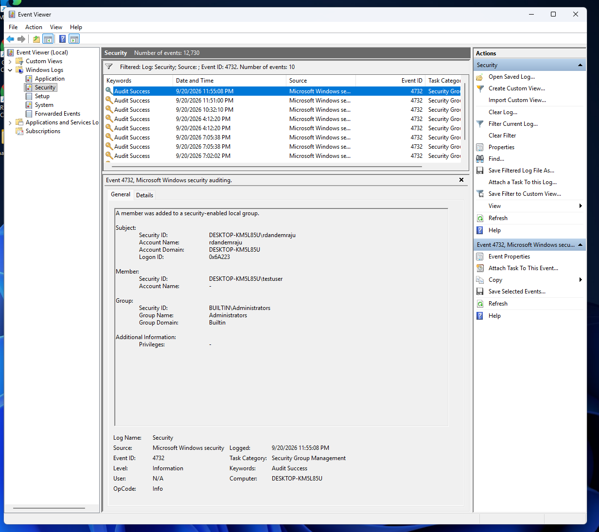

### 9. PowerShell Monitoring

Enabled PowerShell Script Block Logging.

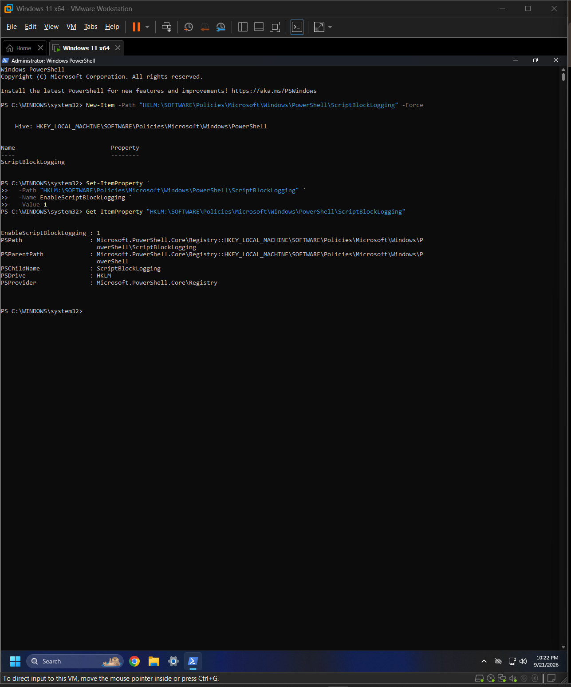

Generated a controlled PowerShell command and identified PowerShell Event ID 4104.

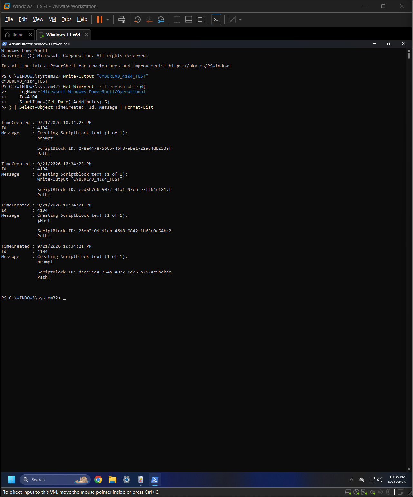

The same activity was correlated with Sysmon Event ID 1, which recorded the PowerShell process, command line, user, executable hash, and parent process.

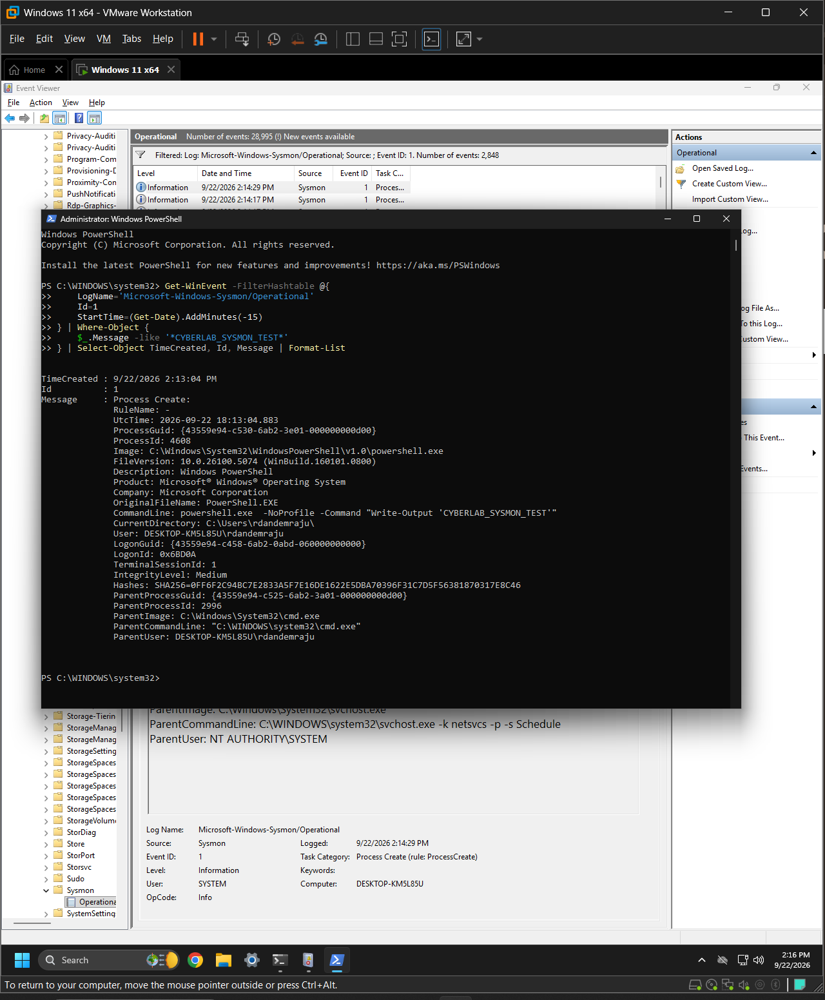

### 10. Windows Service Creation Monitoring

Created a controlled Windows service named `CyberLabService`.

Windows System Event ID 7045 recorded the service installation, including the service name, executable path, start type, and service account.

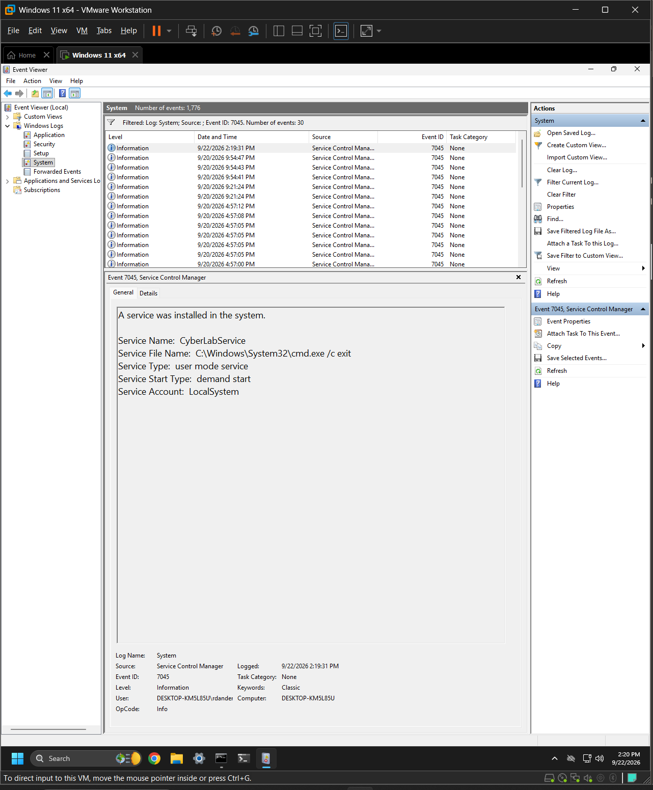

## Current Findings

The lab successfully captured several types of security-relevant Windows activity.

- Event ID 4625 captured repeated failed interactive logon attempts
- Event ID 4720 captured local user account creation
- Event ID 4732 captured a user being added to the Administrators group
- Event ID 4104 captured PowerShell script block activity
- Sysmon Event ID 1 captured PowerShell process creation and command-line information
- Event ID 7045 captured Windows service creation

These events demonstrated how Windows Security logs, PowerShell logs, and Sysmon can provide different pieces of information about the same system activity.

## Skills Demonstrated

- Windows security monitoring
- Microsoft Sysmon
- Windows Event Viewer
- Windows Security auditing
- Process monitoring
- Network monitoring
- File monitoring
- DNS monitoring
- Authentication monitoring
- Account and privilege change monitoring
- PowerShell logging
- Service creation monitoring
- Event correlation
- Detection analysis
- Incident investigation
- Security documentation

## Incident Reports

- [Incident 001: Repeated Failed Logon Attempts](incident-reports/incident-001-failed-logons.md)

## Next Steps

The Windows endpoint monitoring phase of this lab is complete.

Future expansions will include:

- Deploying a Wazuh SIEM server
- Connecting the Windows endpoint to Wazuh
- Centralizing Windows and Sysmon telemetry
- Building SIEM detection rules and alerts
- Expanding the environment with Active Directory
- Generating controlled attack simulations
- Investigating and correlating alerts across multiple systems
